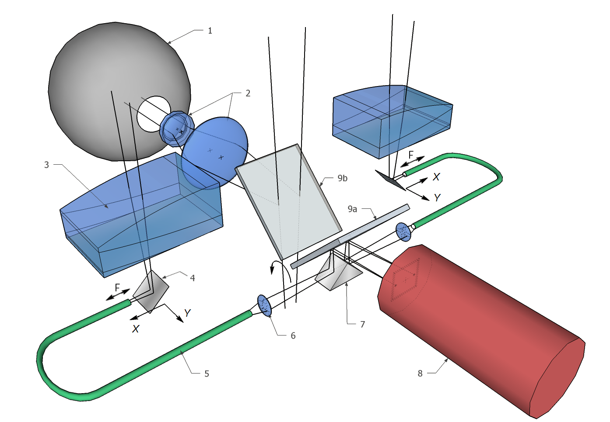
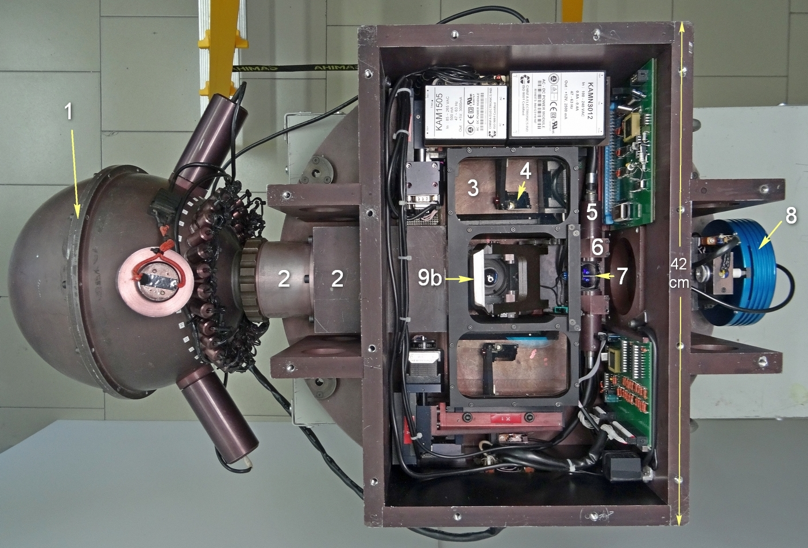

[TOC]

# Введение
## Общий вид

Адаптер устанавливается на поворотном столе в кабине первичного фокуса БТА и применяется как для внеосевого гидирования, так и для телецентрической засветки входа устанавливаемого на нем прибора различными калибровочными источниками света. Кроме фокальных редукторов SCORPIO-1 и SCORPIO-2 на нем могут быть установлены и другие спектрографы весом до 150 кг и рабочим отрезком не более 40 мм.

**Рис.1**. *Оптическая схема (выше)  и фотография (ниже) Адаптера*: *1 — интегрирующая сфера, 2 — оптика осветителя калибровки, 3 — внеосевой линзовый корректор, 4 — зеркало, 5 — жгут световодов, 6 — линза световода, 7 — отражающая призма, 8 — подсмотр, 9 — диагональное зеркало (показаны оба положения): 9a — FIBERS, 9b — FIELD.* 

На **Рис. 1** приведена схема адаптера. В адаптере имеются два подвижных поля для поиска опорных звезд. Свет от такой звезды сначала попадает на внеосевой линзовый корректор (3), который компенсирует кому главного зеркала телескопа. Далее диагональное зеркало (4) перебрасывает свет на входной торец жгута световодов (5), который вместе с зеркалом перемещается по полю в двух перпендикулярных направлениях линейными
подвижками фирмы STANDA[^1]. Угловой диаметр жгута световодов в проекции на небесную сферу при этом составляет 54", а размер поля для его перемещения — 10' × 4 .5'. Центры гидировочных полей находятся на расстоянии 12' от центра полей зрения системы, относительное расположение полей показано далее в **Подразделе 3.2**. Изображения выходных торцов световодов проецируются линзой (6) и направляются призмой (7) и диагональным зеркалом (9) на фокальную плоскость светоприемника подсмотра (8). Зеркало (9) имеет два рабочих положения — *FIBERS* (9a) и *FIELD* (9b). На рис. 1 показаны оба положения. При положении *FIBERS* свет от объектов наблюдения принимается аппаратурой, установленной на адаптере (зеркало выведено из пучка), а подсмотр принимает изображения опорных звезд. В положении *FIELD* диагональное зеркало передает изображение основного поля зрения на подсмотр (зеркало перекрывает центральный пучок), что позволяет делать отождествление поля, в том числе устанавливать на щель яркие объекты. Размер поля FIELD на подсмотре составляет 3' × 2'. В этой же позиции зеркала проводится калибровка основного приемника с помощью интегрирующей сферы (1).

Подробнее калибровочный модуль описан в [**Разделе 4**](3_Calibration.md).

## Внеосевой линзовый корректор

Основной проблемой при внеосевом гидировании на БТА является аберрация комы параболического зеркала. Штатный корректор исправляет аберрации в поле диаметром 18 и не может быть использован в нашей схеме, поскольку устанавливаемые на адаптер приборы работают без линзового корректора. Нами разработан и изготовлен относительно простой двухлинзовый корректор из отечественных стекол К8 и ТФ3. Корректор ахроматизован в диапазоне 0.5–0.7 мкм и дает эквивалентное фокусное расстояние телескопа 18.5 м. Оптическая схема корректора представлена на **рис. 2**. 

**Рис.2**. *Оптическая схема внеосевого линзового корректора.* 

Фокальная поверхность корректора FC в пределах движения жгута световодов в первом приближении плоская. Ее наклон к фокальной плоскости телескопа FT составляет 3*.*9 *◦* . 

На **рис. 3** показан результат исправления комы на расстоянии примерно 12' от оси главного зеркала.

**Рис.3**. Расчетные точечные диаграммы на расстоянии примерно 12" от оси главного зеркала: слева — без корректора, справа—с корректором.

Расчетная полихроматическая функция рассеяния скорректированного изображения показана на **рис. 4**. 

**Рис.4.** Средняя концентрация энергии в кружке (пятне) рассеяния в пределах диапазона расстояний 8–15' от оптической оси.

Как видно на рисунке, качество (*FWHM*) формируемого совместно с корректором изображения не хуже 40 мкм, что соответствует примерно 1"*;* этого вполне достаточно для гидирования. Расчеты оптической схемы сделаны при помощи программы ZEMAX[^2].

## Подсмотр

Вначале мы использовали в качестве подсмотров телевизионные передающие трубки ЛИ-702 с предусилением на ЭОП с микроканальной пластиной. Начиная с 2007 г. в качестве подсмотра для гидирования используется промышленный монохромный приемник ПЗС Sony ICX429ALL формата 1/2 дюйма. Число элементов—582 *×* 752. Управление его параметрами осуществляется с помощью интерфейса RS-232, а оцифровка изображения производится TV-тюнером. К концу 2017 г. планируется переход на коммерческую камеру Atik Titan[^3] на основе аналогичного приемника Sony ICX424 с передачей изображений в компьютер по интерфейсу USB. На рис. 5 (слева) приведен пример изображения основного поля звезд — *FIELD*. Для наглядности приведены значения звездных величин в полосе *R*  для некоторых звезд. Для режима FIELD размер поля составляет 3’ *×* 2’*.* Справа на **рис. 5** приведен пример изображения от световодов — *FIBERS*. Из-за поглощения в световодах в режиме *FIBERS* пропускание в два раза ниже, чем в режиме *FIELD*. Однако  чувствительности приемника достаточно для уверенной регистрации безлунного фона неба.

**Рис. 5**. Пример изображений в режиме FIELD (слева) и FIBERS (справа). Указаны звездные величины слабых звезд в полосе R по данным USNO2.0.

## Система управления

Управление адаптером реализовано аналогично управлению другими узлами прибора SCORPIO-2. Разработаны две платы, оснащенные микропроцессорами ATmega8535L и силовыми микросхемами для управления семью шаговым двигателями и калибровками адаптера. Одна плата управляет четырьмя двигателями перемещения двух гидировочных полей по координатам *X*, *Y* и двумя двигателями фокусировки этих полей. Вторая плата управляет двигателем переброса диагонального зеркала FIELD/FIBERS, лампой линейчатого спектра (NEON), лампой непрерывного спектра (QUARTZ) и работой 32 светодиодов, формирующих плоское поле.

Пределы перемещений всех подвижек контролируются концевыми выключателями. Текущее положение гидировочных полей (*X, Y* ) и величина фокуса рассчитываются по числу пройденных шагов от начального положения. Внешние команды управления на микропроцессоры передаются по стандартному интерфейсу RS-422 от управляющего промышленного компьютера, работающего в среде Windows. Программы микропроцессоров настроены на самостоятельную работу: получив команду, они выполняют ее и по запросу управляющего компьютера сообщают о результатах. Интерфейс управления адаптером написан на языке IDL4 и интегрирован в общую систему управления прибором SCORPIO-2.

