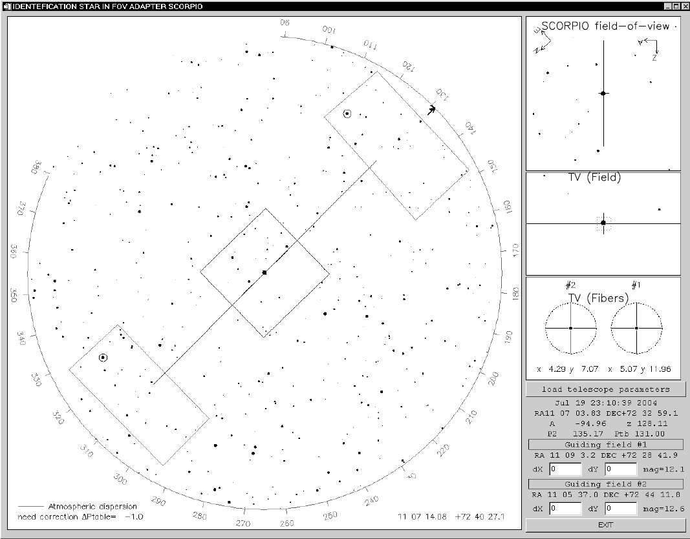
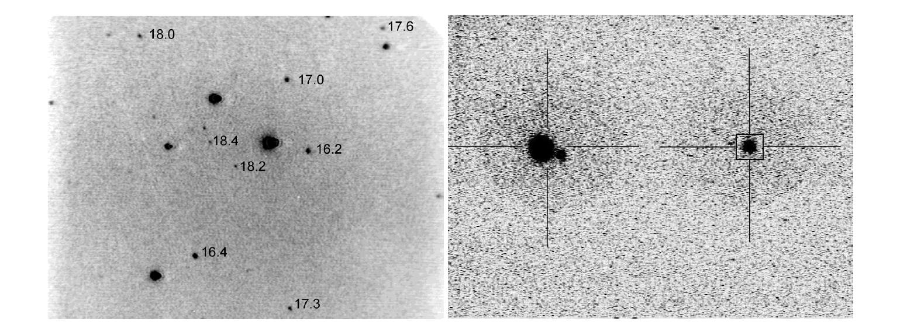
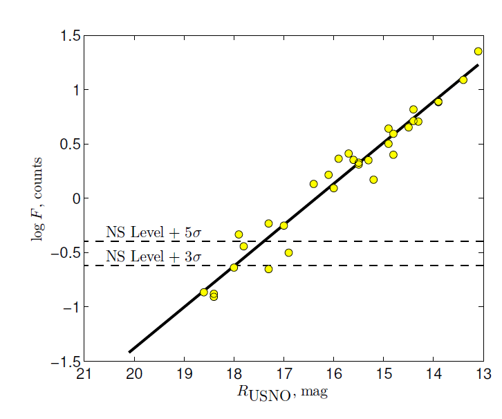

# Модуль гидирования
После наведения на исследуемый объект перед началом гидирования наблюдатель выполняет ряд подготовительных процедур, включающих поиск опорных звезд, подбор оптимальной яркости на подсмотре, предварительное центрирование. Потом запускается программа гидирования. В случае отклонения центроида изображения звезды от заданного наблюдателем положения на подсмотре она отправляет управляющей телескопом программе поправки для коррекции.

## Программа поиска опорных звезд

Для ускорения процесса наведения и поиска опорных звезд мы используем пакет программ  IDENTSTAR, написанный на языке IDL и позволяющий по переданным из управляющего компьютера БТА координатам и ориентации поворотного стола вычислять текущие инструментальные координаты полей звезд гидирования в поле зрения адаптера. На **рис. 6** показан вид интерфейса программы поиска звезд. После запуска программа считывает с сервера БТА текущие  координаты телескопа и выбирает из каталога USNO2.0 координаты всех звезд ярче 20 mag в данной площадке неба радиусом 15’*.*

**Рис. 6.** Интерфейс программы поиска гидировочных звезд

Большой центральный квадрат в окне отмечает положение поля зрения SCORPIO-2 (6 *×* 6*),*  прямоугольниками выделены положения пределов перемещения полей гидирования, внутри которых программа ищет звезды для гидирования. Маленькими кружками, размеры которых соответствуют диаметрам жгутов световодов, выделены наиболее яркие звезды, которые были автоматически выбраны программой. Их звездные величины и положение в системе координат платформы-адаптера отображаются в правых нижних полях окна программы. При необходимости наблюдатель может выбрать другую опорную звезду из доступных в поле. Одновременно со звездной картой из каталога на подсмотре отображается расчетная конфигурация звезд в положениях FIELD/FIBERS. Как показывает опыт наблюдений, время на поиск и установку звезд гидирования обычно не превышает нескольких минут. При этом возможна  предварительная установка звезд во время перенаведения телескопа с одного объекта на другой.

## Программа гидирования

Для автоматического гидирования по выбранной звезде используется программа TVGuide, написанная нами в среде IDL на основе оцифровки изображения подсмотра с коммерческой камеры Atik Titan[^3] на основе приемника Sony ICX424 с передачей изображений в компьютер по интерфейсу USB.

На **рис. 5** (слева) приведен пример изображения основного поля звезд — *FIELD*. Для наглядности приведены значения звездных величин в полосе R для некоторых звезд. Для режима *FIELD* размер
поля составляет 3’ × 2’. Справа на рис. 5 приведен пример изображения от световодов — *FIBERS*.
Из-за поглощения в световодах в режиме *FIBERS* пропускание в два раза ниже, чем в режиме FIELD.
Однако чувствительности приемника достаточно для уверенной регистрации безлунного фона неба.

 

**Рис.5**. *Пример изображений в режиме FIELD (слева) и FIBERS (справа). Указаны звездные величины слабых звезд в полосе R по данным USNO2.0.*

Кроме визуализации изображения с подсмотра программа позволяет накладывать на изображение электронные кресты и метки. В зависимости от положения зеркала адаптера в большом окне программы на изображении отображаются либо положение щели в поле FIELD с исследуемым объектом, либо два креста в полях гидирования FIBERS, в центры которых захватываются звезды.

## Предельные звездные величины

В процессе гидирования тюнер опрашивает выход подсмотра с частотой 25 кадров в секунду; для улучшения шумовых характеристик изображения усредняются скользящим средним с окном от 2 до 50 кадров. Измерения предельных величин звезд, пригодных для гидирования, проводились в ноябре 2015 г. при ясном небе и качестве изображений *θ* = 1 *−* 1 .5”. График оценок потока опорных звезд в зависимости от их звездной величины по каталогу USNO2.0 приводится на **рис. 7**. 

**Рис. 7.** *Логарифмы потоков опорных звезд lg F в зависимости от их звездной величины RUSNO. При считывании изображений использовался режим скользящего среднего по 10 кадрам.*

Интенсивность была предварительно скорректирована за коэффициент усиления ПЗС-подсмотра, настраиваемый отдельно для каждой опорной звезды. Штриховые линии показывают уровни шума ночного неба с порогом обнаружения 3*σ* NS и 5*σ* NS. Линия регрессии пересекает штриховые линии в точках 18.0m и 17.4m, что дает предельные звездные величины в полосе *R* для отношений сигнала к шуму *S/N* = 3 и 5 соответственно. Оптимальным для гидирования является диапазон звездных величин 10 – 15 mag. Гидирование по звездам слабее 15m возможно только при хорошем качестве изображений и достаточной прозрачности. Следует отметить, что из-за особенностей системы управления БТА автоматическая коррекция координат осуществляется с частотой не более 0.1 Гц.

## Контроль прозрачности атмосферы и качества гидирования

Калибровка нуль-пункта для каждого жгута световодов подсмотра осуществлялась по наблюдениям реальных звезд при хорошей прозрачности. Ее результаты представлены на **рис. 8**. После  проведенных нами процедур калибровки стал возможен количественный контроль прозрачности атмосферы по опорным звездам. Отметим, что в ходе наблюдений калибровочные зависимости продолжают уточняться. Систематические ошибки измерения поглощения в атмосфере из-за несоответствия кривой чувствительности приёмника подсмотра и кривой пропускания фильтра *R*USNO по нашим оценкам не превышают 0.5 mag. Для контроля качества гидирования на монитор управляющего компьютера может выводиться график, на котором отображаются: текущее значение поглощения, размер изображения опорной звезды и величины коррекции по азимуту и зенитному расстоянию (см. **рис. 9**).

**Рис. 9.** *Интерфейс окна мониторинга изображения опорной звезды. В заголовке окна: координаты звезды, звёздные величины в фильтрах R и B из каталога USNO2.0, номер жгута световодов. Графики сверху вниз: поглощение в фильтре R, качество изображения, смещение центроида опорной звезды по азимуту (в угловых секундах), аналогичное смещение по зенитному расстоянию. Справа: текущие значения; внизу: статусная строка.*

## Фокусировка

Входной торец каждого из гидировочных жгутов перемещается вдоль оптической оси в пределах 0–9.7 мм для фокусировки опорной звезды (см. **рис. 1**). Это дает возможность проводить при необходимости коррекцию фокуса телескопа во время длительной (более одного часа) серии спектральных экспозиций. Опыт наблюдений на БТА показывает, что изменения фокуса из-за температурных деформаций штанг трубы телескопа за это время могут превышать 0.1–0.2 мм, что является существенной величиной в случае хорошего качества изображений (*θ <* 2”). Выполнив фокусировку телескопа и гидировочных микроскопов перед началом серии экспозиций, можно в дальнейшем контролировать положение лучшего фокуса, используя механизм фокусировки гидировочных полей и осуществлять компенсирующую коррекцию фокусного расстояния телескопа. Наличие двух гидировочных полей позволяет проводить процедуру контроля фокуса по одной из звезд, пока другое поле используется для сопровождения телескопа.