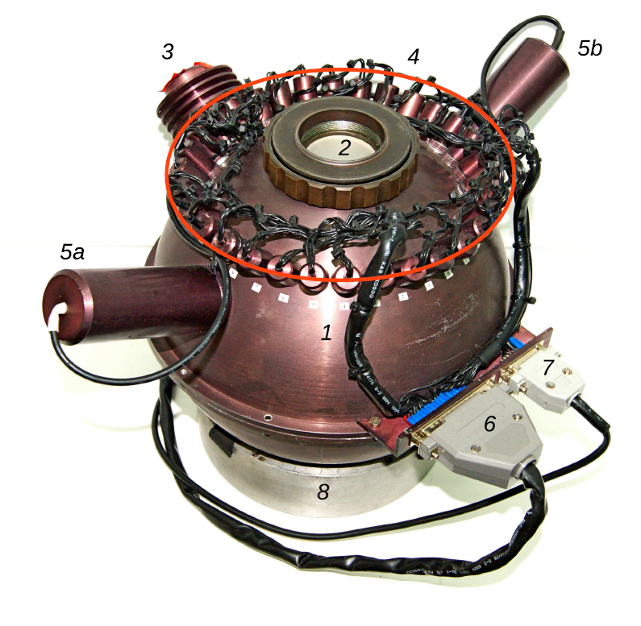

[TOC]

# 3 Модуль калибровки
## Общее описание

Калибровочный модуль состоит из интегрирующей сферы (шар Ульбрихта), оптики осветителя калибровки и системы управления. Интегрирующая сфера имеет два осветителя линейчатого спектра, осветитель непрерывного спектра и 32 порта для установки светодиодов в качестве осветителей. Как источник линейчатого спектра используется газоразрядная радиолампа СГ3С с наполнением He–Ne–Ar. Источники непрерывного спектра—одна галогеновая лампа с кварцевым стеклом Osram Halopar-16 50W и серия из 32 светодиодов.

**Рис.** *Калибровочная лампа Адаптера ПФ: 1 – интегрирующая сфера; 2 – крепление к платформе-адаптеру; 3 – кварцевая лампа; 4 – светодиодная система; 5a, 5b – He–Ne–Ar лампы; 6 – разъем управления и питания светодиодами; 7 – разъем питания неоновой лампы; 8 – специальная подставка для транспортировки.*

Оптика осветителя калибровки формирует на входе редуктора сходящийся пучок со светосилой, эквивалентной светосиле телескопа (*f/*4). При этом изображение равномерно освещенной площадки на выходе интегрирующей сферы строится там же, где находится изображение зеркала телескопа (выходной зрачок) и, следовательно, выполняется условие телецентризма. Проецируемый диаметр площадки осветителя совпадает с диаметром зрачка. В нашем случае точность выполнения условия телецентризма оказывается не хуже 0.2%. Такое решение позволяет проводить корректную калибровку шкалы длин волн лампой линейчатого спектра и калибровку пропускания системы по полю в различных режимах спектральных наблюдений («плоское поле»). Выходная площадка интегрирующей сферы освещается тремя способами:

- NEON: лампа с He–Ne–Ar-наполнением для калибровки шкалы длин волн. Используется в режимах щелевой и панорамной спектроскопии, а также при наблюдениях со сканирующим интерферометром Фабри–Перо **[10]**. Калибровка обычно выполняется каждый раз, когда изменение зенитного расстояния телескопа превышает 10–20◦, с целью учета гнутий прибора.

- QUARTZ: кварцевая галогеновая лампа непрерывного спектра для создания «плоского поля». Калибровка обычно выполняется в начале и в конце наблюдений в режиме сканирующего интерферометра и несколько раз в течение ночи при спектральных наблюдениях на разных зенитных расстояниях. Существенным недостатком такого осветителя является сильное падение яркости лампы в голубой области, так как максимум ее излучения приходится на длину волны около 1200 нм. Поэтому на длинах волн *λ <* 500 нм в наблюдаемый спектр лампы вносится существенный вклад рассеянного света от более длинноволновой части спектра. Применение выравнивающих светофильтров немного улучшает ситуацию.

- LEDS: система светодиодов, обеспечивающая формирование непрерывного спектра для «плоского поля» с приблизительно равномерной по спектру яркостью в широком диапазоне длин волн. Это позволяет проводить равноточную засветку плоского поля в различных спектральных диапазонах и уменьшает паразитный рассеянный свет в голубой области. Впервые подобное решение было предложено для фотометрической калибровки на малых телескопах **[11, 12]** и пока еще не используется на крупных. Например, систему из 18 светодиодов планируется применять в осветителе «белого света» спектрографа EXPRES **[13]**.

Остановимся подробнее на последнем варианте засветки — светодиодной системе LEDS.

## Светодиодная система

Современная промышленность предоставляет широкий ассортимент различных светодиодов (light-emitting diode, LED) во всем оптическом диапазоне. Каждый светодиод излучает непрерывный спектр в узком диапазоне с шириной полосы около 10–20 нм. Подбирая яркости отдельных элементов в наборе таких светодиодов, можно конструировать спектральное «плоское поле» для различных решеток с учетом спектральной чувствительности устанавливаемого на адаптере прибора. Для управления яркостью отдельных светодиодов мы используем широтно-импульсную модуляцию (ШИМ). При этом на каждый светодиод подается периодический сигнал прямоугольной формы с различной скважностью, изменяющейся дискретно в диапазоне от 0 до 253. Такая реализация наряду с простотой в исполнении обеспечивает высокую стабильность яркости светодиодов. Управление светодиодами осуществляется тем же микропроцессором, который установлен на второй плате (см. [**Раздел 1 **](Intro.md): Система управления). Программа, запускаемая на управляющем компьютере в среде IDL, позволяет выбирать либо стандартную конфигурацию засветки, либо индивидуально настраивать яркости отдельных светодиодов.

Для иллюстрации методики LEDS на **рис. 10** приведен пример сконструированного «плоского поля» для решетки VPHG940@600, имеющей рабочий диапазон 3500–8500 A˚.

**Рис. 10.** *Спектральные «плоские поля» для решетки VPHG940@600, полученные c помощью кварцевой лампы QUARTZ (с выравнивающим светофильтром) и системы светодиодов (LEDS). Порядковыми номерами показаны спектральные кривые соответствующих светодиодов. Спектры нормированы на экспозицию в 1 секунду.*

## Стабильность светодиодов

Калибровочная лампа, состоящая из набора светодиодов, должна обеспечивать повторяемость формы спектра в диапазоне температур Δ*T* = *−*20...+40*◦*C. Оценивая стабильность светового потока излучения диода при изменениях температуры внешней среды *T*, будем руководствоваться эмпирическим выражением из **[14]**:
$$
 F=F_{300} \exp\left(- \frac{ T[K] – 300}{T_1}\right)
$$
где *F*300 —поток диода при температуре, близкой к комнатной, *T*1 — характеристическая температура для данного класса диодов. Экспериментальные значения параметра *T*1 для синих, зеленых и красных диодов — 1600, 295 и 95 K соответственно взяты из **[14]**. Как видно из **(1)**, поток излучения красных диодов наиболее чувствителен к изменениям температуры и, следовательно, в этом диапазоне вариации формы спектра будут наиболее сильны. Оценим ее стабильность, рассмотрев чувствительность потока красных светодиодов как худший вариант. Возьмем производную от выражения **(1)**:
$$
\delta F/F_{300}= -\exp\left(-\frac{T – 300}{T_1} \right) \frac{\delta T}{T_1}
$$
и рассчитаем температурный коэффициент потока при изменении температуры на один градус. В таблице для иллюстрации эффекта приведены характерные значения производных в рабочем диапазоне температур для красных светодиодов. При оценке возможных колебаний спектра лампы необходимо учесть, что за время спектральной экспозиции (от 5 до 60 минут) температура в первичном фокусе телескопа изменяется не более чем на 1–2◦C. Для оценки реальной стабильности светодиодной засветки в лаборатории были получены два ряда спектральных «плоских полей» с прибором SCORPIO-2 с использованием решетки VPHG940@600 —в течение 10 часов c шагом в 1 час и в течение 1 часа с шагом в 1 минуту. **На рис. 11** показаны относительные вариации «плоского поля» в зависимости от длины волны . 

**Рис. 11.** *Относительные вариации спектрального «плоского поля» с решеткой VPHG940@600, полученного светодиодной засветкой, в зависимости от длины волны.*

Область *A* показывает разброс для 10-часового эксперимента, что примерно имитирует ситуацию одной наблюдательной ночи. Для сравнения приведена область *B*, соответствующая расчетному пуассоновскому шуму. Пуассоновский шум рассчитывался как
$$
1/\sqrt{N_{s} \times gain},
$$
где  Ns — число отсчетов на данной длине волны, *gain*—коэффициент усиления ПЗС-приемника. Реальный шум в спектре показан жирной линией и хорошо согласуется с теоретическим. Область *C* показывает разброс для 1-часового эксперимента, что примерно имитирует ситуацию наблюдений одного объекта. Видно, что вариации в течение часа (*C*) меньше пуассоновского шума (*B*). Определение вариаций обоих рядов данных и величины пуассоновского шума проводилось в интервалах шириной 200A.  Следует отметить, что, несмотря на небольшие колебания  температуры внешней среды за 10 часов (в пределах 5◦>C), мы видим постепенное увеличение амплитуды вариаций от 1% до 2% с ростом длины волны . После 7500A вариации падают до 1%, что отражает вклад второго порядка решетки VPHG940@600, а засветка в этом диапазоне также формируется голубыми светодиодами. Итак, «плоское поле,» получаемое по методике LEDS, дает более равномерную засветку по длинам волн в сравнении с QUARTZ (**рис. 10**). Было бы разумно предположить, что гибридное «плоское поле» QUARTZ+LEDS, в котором LEDS исправляет  недостатки QUARTZ в синем спектральном диапазоне, является оптимальным решением. Однако светодиоды и кварцевая лампа расположены близко друг к другу, и кварцевая лампа при включении сильно прогревается, поэтому при одновременном использовании обеих засветок свойства светодиодов изменяются. Это стоит учитывать при наблюдениях и проектировании аналогичных систем. 

> ВНИМАНИЕ: Рекомендуется при спектральных наблюдениях в течение ночи использовать LEDS до QUARTZ (если необходимы оба типа засветки), а также разграничить их использование при калибровках до или после наблюдений.

Тот факт, что светодиоды сейчас широко распространены и относительно дешевы, дает основание полагать, что подобная методика может легко внедряться на современных спектрографах.

