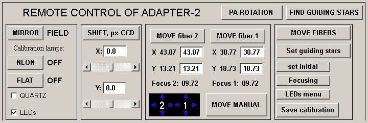

# Управление Адаптером
В данном разделе будут подробно описаны все элементы управления Адаптером. До начала работы необходимо запустить основную оболочку SCORPIO и программу гидирования.

Иконки программ управления SCORPIO и камерой гидирования Atik:  

### Общий вид

#### Отличия от интерфейса управления старой платформой
- Положение зеркала, ламп и концевиков подвижек постоянно мониторятся и отображаются.
  Во время переезда, состояние зеркала = GO.
- У лампы FLAT - два параметра: QUARTZ (лампа непрерывного спектра) и LEDs (линейка
  светодиодов). Можно выделить флажком один или сразу оба.
- Вместо того, чтобы нажимать кнопки **`MOVE fiber 1/2`**, **`MOVE FIBERS`**,  **`SHIFT, pх CCD`**,
  достаточно нажать [ENTER] в соответствующем поле.
- Можно одновременно запускать перемещения любого элемента, пока другие еще едут.
- Если нажать одновременно стрелочки X и Y – будет ехать сразу по обеим координатам.
- Кнопка **`set initial`** устанавливает в ноль только X и Y, не двигая фокус и зеркало.
- Добавлена кнопка вызова программы управления светодиодами и лампами LEDs menu
- Управление фокусами обоих микроскопов вынесено в отдельное меню (**рис. ??**), запускаемое кнопкой **`focusing`**. Из этого меню есть возможность двигать фокус стрелочками с клавиатуры, зарезервированы поля для автофокусировки.

### Поворотный стол

Запускается кнопкой **`PA ROTATION`**

Для установки требуемой ориентации щели спектрографа необходимо в меню управления платформой адаптером нажать кнопку **`PA Rotation`.** Открывается окно ‘POSITION ANGLE of the SLIT’ показанное на **рис**. выше. Здесь слева красной линией показано текущее положение щели спектрографа относительно направлений "север-юг" и "запад-восток, а справа такой же линией отмечено текущее положение поворотного стола ПФ. Красная стрелочка показывает скорость вращения стола в единицах ◦/час.
Ниже в виде таблицы указаны текущие значения **Current** угла поворотного стола **PA(table)** и позиционного угла щели **PA(slit)** (отсчитывается от направления на север против часовой стрелки). 

В графе **Texp** показывается время, оставшееся до достижения концевика поворотного стола (т.е. максимальное время экспозиции, при условии, что будут продолжаться наблюдения данного объекта).

Графа **New** предназначена для ввода новых значений углов. Причем можно вводить как значения PA(slit), так и PA(table), при вводе одного из этих углов второй пересчитывается (константу для пересчета программа берет из конфигурационного файла). Новые значения углов отображаются на графиках синим пунктиром, а в графе Texp показывается максимально возможное время экспозиции с новым положением поворотного стола. Нажатие кнопки **`PA+180`** меняет значения новых углов на 180◦, это полезно в тех случаях, когда требуются либо более продолжительные экспозиции, либо меньшее различие между текущим и новым положением поворотного стола. 

Нажатие кнопки **`Rotation`** приводит к вращению поворотного стола к его новому положению. Остановить вращение стола из этого меню нельзя, надо использовать программы непосредственного управления телескопом на компьютере robs1 (интерфейс оператора БТА и т.п.).
**`QUIT`** – выход из программы.

### Поиск звезд гидирования

Запускается кнопкой **`FIND GUIDING STARS`**

### Диагональное зеркало и осветители

Кнопка **`MIRROR`**  переключает диагональное зеркало (или переброса) между двумя положениями — *FIELD* и *FIBERS*.

Кнопка **`NEON`**  принудительно включает лампу линейчатого спектра He-Ne-Ar.

Кнопка **`FLAT`**  принудительно включает лампу непрерывного спектра на основе кварца.

- [ ] QUARTZ  - флажок, позволяющий использовать кварцевую лампу в режиме накоплений **flat**
- [x] LEDs - флажок, позволяющий использовать светодиоды в режиме накоплений **flat**

### Коррекция телескопа в терминах пикселей CCD

Данная панель использует для точного наведения на щель и иных задач с помощью отправки смещений положения телескопа в системе координат CCD (X - горизонтальное смещение, Y - вертикальное смещение). 

Кнопка **`SHIFT, px CCD`** отправляет коррекции на телескоп, исходя из значения из полей **X:** и **Y:**, заданных в пикселах.

Смещение ползунков влево и вправо позволяет настроить значение смещения грубо. Для малых коррекций (особенно при установке объекта на щель) вводится более точное значение.

> ВНИМАНИЕ: для корректной работы требуется запуск скрипта bta_control_net на рабочем столе управляющего компьютера.

### Подвижки поисковых фиберов

### Дополнительная панель

**`MOVE FIBERS`** — устанавливает фиберы на значения из полей

**`Set guiding stars`** — забирает значения из полей фиберов из программы поиска звезд

**`set initial`** — устанавливает фиберы “в ноль”, т.е. на нуль-концевики

**`Focusing`** — фокусировка фиберов (отдельное окно)

**`LEDS menu`** — ручное управление светодиодами (отдельное окно)

**`Save calibration `** — (сервисная функция) сохраняет в специальный файл звездные величины для фотометрической калибровки гида (уточнить по коду)

### Фокусировка фиберов

## Программа гидирования

