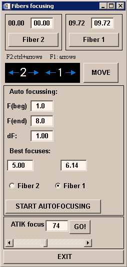
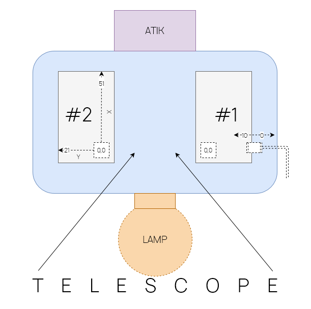

[TOC]

# 4 Управление Адаптером
В данном разделе будут подробно описаны все элементы управления Адаптером. До начала работы необходимо запустить основную оболочку SCORPIO и программу гидирования.

Иконки программ управления SCORPIO и камерой гидирования Atik:  

## Общий вид

Блок управления Адаптером находится в нижней части общей оболочки управления SCORPIO-1/2:

В отличие от интерфейса управления старой платформой, есть особенности использования текущего интерфейса:

- Положение зеркала, ламп и концевиков подвижек постоянно мониторятся и отображаются.
  Во время переезда, состояние зеркала = GO.
- У лампы FLAT - два параметра: QUARTZ (лампа непрерывного спектра) и LEDs (линейка
  светодиодов). Можно выделить флажком один или сразу оба.
- Вместо того, чтобы нажимать кнопки **`MOVE fiber 1/2`**, **`MOVE FIBERS`**,  **`SHIFT, pх CCD`**,
  достаточно нажать [ENTER] в соответствующем поле.
- Можно одновременно запускать перемещения любого элемента, пока другие еще едут.
- Если нажать одновременно стрелочки X и Y – будет ехать сразу по обеим координатам.
- Кнопка **`set initial`** устанавливает в ноль только X и Y, не двигая фокус и зеркало.
- Добавлена кнопка вызова программы управления светодиодами и лампами LEDs menu
- Управление фокусами обоих микроскопов вынесено в отдельное меню (**рис. ??**), запускаемое кнопкой **`focusing`**. Из этого меню есть возможность двигать фокус стрелочками с клавиатуры, зарезервированы поля для автофокусировки.

Рассмотрим далее каждый элемент управления.

## Поворотный стол

Для установки требуемой ориентации щели спектрографа необходимо в меню управления Адаптером нажать кнопку **`PA ROTATION`.** Открывается окно ‘POSITION ANGLE of the SLIT’ показанное на **рис**. ниже. 

Здесь слева красной линией показано текущее положение щели спектрографа относительно направлений "север-юг" и "запад-восток, а справа такой же линией отмечено текущее положение поворотного стола ПФ. Красная стрелочка показывает скорость вращения стола в единицах ◦/час.
Ниже в виде таблицы указаны текущие значения **Current** угла поворотного стола **PA(table)** и позиционного угла щели **PA(slit)** (отсчитывается от направления на север против часовой стрелки). 

В графе **Texp** показывается время, оставшееся до достижения концевика поворотного стола (т.е. максимальное время экспозиции, при условии, что будут продолжаться наблюдения данного объекта).

Графа **New** предназначена для ввода новых значений углов. Причем можно вводить как значения PA(slit), так и PA(table), при вводе одного из этих углов второй пересчитывается (константу для пересчета программа берет из конфигурационного файла). Новые значения углов отображаются на графиках синим пунктиром, а в графе Texp показывается максимально возможное время экспозиции с новым положением поворотного стола. Нажатие кнопки **`PA+180`** меняет значения новых углов на 180◦, это полезно в тех случаях, когда требуются либо более продолжительные экспозиции, либо меньшее различие между текущим и новым положением поворотного стола. 

Нажатие кнопки **`Rotation`** приводит к вращению поворотного стола к его новому положению. Остановить вращение стола из этого меню нельзя, надо использовать программы непосредственного управления телескопом на компьютере robs1 (интерфейс оператора БТА и т.п.).
**`QUIT`** – выход из программы.

> ВНИМАНИЕ: для корректной работы требуется запуск скрипта bta_control_net на рабочем столе управляющего компьютера.

## Поиск звезд гидирования

Программа для поиска звезд гидирования  запускается кнопкой **`FIND GUIDING STARS`**

В основной части окна приводится полное поле зрения со звездами из каталога USNO2.0. По периметру приводятся отметки шкалы позиционного угла PA(table), а красной стрелкой указано текущее значение (на **рис**. это PA(table) = 135). Внизу слева указывается отличие от направления атмосферной дисперсии, а внизу справа — координаты курсора в экваториальных координатах RA(2000) и DEC(2000).

Кроме большой карты поля Адаптера, справа имеется три дополнительных увеличенных карты: 

- звездная карта матрицы CCD: для основного квадратного поля (верхняя панель) с вертикальной щелью, 
- звездная карта подсмотра FIELD: с горизонтальной щелью (**FIXME**: есть отличия в версиях SCORPIO 1 и 2)
- звездная карта подсмотра FIBERS: круги с крестами под надписями #2 и #1

Итак, большой центральный квадрат в окне отмечает положение поля зрения SCORPIO-2 (6’ × 6’),  прямоугольниками выделены положения пределов перемещения полей гидирования, внутри которых программа ищет звезды для гидирования. Маленькими кружками, размеры которых соответствуют диаметрам жгутов световодов, выделены наиболее яркие звезды, которые были автоматически выбраны программой. Их звездные величины и положение в системе координат Адаптера (x 21.81 y 8.30; x 15.61 y 17.92) отображаются в правых нижних полях окна программы – подписи под кругами фиберов #2 и #1. При необходимости наблюдатель может c помощью курсора выбрать и установить левым кликом другую опорную звезду из доступных в основном поле. 

Кнопка `load telescope parameters` обновляет содержимое всех полей окна, что может полезно при смещениях и поворотах стола при поиске гидировочных звезд в бедных полях.

`EXIT` - закрывает окно.

>  ВНИМАНИЕ: Возможна предварительная установка звезд во время перенаведения телескопа с одного объекта на другой.

## Диагональное зеркало и осветители

Кнопка **`MIRROR`**  переключает диагональное зеркало (или переброса) между двумя положениями — *FIELD* и *FIBERS*.

Кнопка **`NEON`**  принудительно включает лампу линейчатого спектра He-Ne-Ar.

Кнопка **`FLAT`**  принудительно включает лампу непрерывного спектра на основе кварца.

- [ ] QUARTZ  - флажок, позволяющий использовать кварцевую лампу в режиме накоплений **flat**
- [x] LEDs - флажок, позволяющий использовать светодиоды в режиме накоплений **flat**

## Коррекция телескопа в терминах пикселей CCD

Данная панель использует для точного наведения на щель и иных задач с помощью отправки смещений положения телескопа в системе координат CCD (X - горизонтальное смещение, Y - вертикальное смещение). 

Кнопка **`SHIFT, px CCD`** отправляет коррекции на телескоп, исходя из значения из полей **X:** и **Y:**, заданных в пикселах.

Смещение ползунков влево и вправо позволяет настроить значение смещения грубо. Для малых коррекций (особенно при установке объекта на щель) вводится более точное значение.

Кроме наведения на щель, функция **`SHIFT, px CCD`** используется в фотометрических наблюдениях, а также при получении плоских сумеречных полей для смещения кадра и последующего медианного исключения звезд.

> ВНИМАНИЕ: для корректной работы требуется запуск скрипта bta_control_net.bat на рабочем столе управляющего компьютера.

## Подвижки поисковых фиберов

**`MOVE fiber 1/2`** — передвигает фиберы в положение, указанное в полях (есть возможность изменять вручную), кнопки позволяют использовать фиберы по отдельности.

**`MOVE MANUAL`** — включает ручное управление фиберами с помощью клавиатуры, это особенно актуально при корректировке гидировочной звезды после приезда на расчетное положение X, Y, которое берется из каталога USNO2.

Для фибера 1 (правый на подсмотре): **[←], [→], [↑], [↓]**

Для фибера 2 (левый на подсмотре): **[Ctrl] + [←], [→], [↑], [↓]**

Синие стрелочки показывают индикацию при работе.

## Дополнительная панель

- **`MOVE FIBERS`** — устанавливает фиберы на значения из полей;
- **`Set guiding stars`** — забирает значения из полей фиберов из программы поиска звезд;
- **`set initial`** — устанавливает фиберы “в ноль”, т.е. на нуль-концевики;
- **`Focusing`** — фокусировка фиберов (отдельное окно);
- **`LEDS menu`** — ручное управление светодиодами (отдельное окно);
- **`Save calibration `** — (сервисная функция) сохраняет в специальный файл звездные величины для фотометрической калибровки гида (уточнить по коду);

## Управление яркостью светодиодов

После нажатия **`LEDS menu`** мы открываем следующее окно:

## Фокусировка фиберов

Программа фокусировки фиберов Fibers Focusing позволяет:

1. ввести значения фокуса вручную из поля ввода;
2. сдвинуть значения с помощью клавиатуры — фибер1: **[Ctrl] + [←], [→]** ; фибер 2: **[←], [→]**;
3. произвести автофокусировку.

Данная программа может актуальна в начале сета для проверки сфокусированности фиберов и более четкого гидирования. 

> ВНИМАНИЕ: при хорошем качестве изображений для длинных экспозиций есть резон корректировать фокус БТА на значение в мм, полученное по отклонению значения фокуса фибера второй (негидирующей) звезды. В этом случае используется режим автофокусировки. При этом необходимо заблаговременно установить вторую звезду в центр фибера.

## Программа гидирования AtikGuide

Программа AtikGuide носит такое название исходя из семейства Atik, используемых нами для подсмотра.

Рабочей областью является поле захвата изображения с подсмотра, которое имеет различный вид в зависимости от положения диагонального зеркала (см. скриншоты ниже).

**FIELD**:  на изображение поля накладывается положение щели (желтые вертикальная линия для SCORPIO-1 и горизонтальная — для SCORPIO-2), а также специальный малый квадрат на щели, отмечающий центр вращения поля. На скриншоте ниже также показан указатель центроида красным кружком и большой бокс для измерения параметров звезды (используется процедурами `SEEING` и `MONITORING PLOT`)

Рис. *Основное окно управления подсмотром и гидированием AtikGuide в режиме FIELD для SCORPIO-2.*

**FIXME** - обновить картинку FIELD, добавить стрелки RA-DEC, какое-нибудь поле (например, галактика).

**FIBERS**:  на изображение поля накладываются две маски в виде больших кругов для обоих световодов, внешняя часть захваченного изображения игнорируется.

Рис. *Основное окно управления подсмотром и гидированием AtikGuide в режиме FIBERS.*

Рис. *Схема движения фиберов в самом приборе*.

**FIXME** - обновить картинку FIBERS, добавить стрелки AZ, две звезды разной яркости по центру с включенными опциями FIX Guiding Box, MON PLOT, guide log и гидированием (зеленым).

**FIXME** - SAVE FITS need debug

Основная панель операций:

  **`START`** — включает гидирование, перед этим необходимо провести предварительную процедуру установки звезды;

  **`STOP`** — выключает гидирование;

- [ ] **MONITORING PLOT** — запускает дополнительное окно мониторинга параметров, вычисляемые по звезде гидирования (описано ниже);

- [ ] **Guide Log** — запускает дополнительное служебное окно с журналом коррекций телескопа, куда выводятся время и величины коррекций.

**atik exposure** — слайдер для регулировки значения экспозиции камеры подсмотра (0-2000ms). Рекомендуется использовать значение 400ms для большинства задач.

**contrast** — слайдер для регулировки контраста изображения (в режиме Autorange не учитывается).

**background** — слайдер для регулировки фона изображения (в режиме Autorange не учитывается).

- [x] **A U T O R A N G E** — флажок включения/выключения режима автодиапазона вывода изображения, включено по умолчанию. Позволяет отдельно работать со статистикой изображений фиберов, выводя для каждого различные значения контраста и фона.

**Box size** (arcsec) [    ] — задает размер бокса гидирования, стандартный размер 15 arcsec достаточен для большинства задач.

- [ ] **FIX Guiding Box** — фиксирует положение бокса гидирования во избежание нечаянного изменения его положения во время гидирования, по умолчанию отключено для выбора звезды гидирования.

**dX:** [   ]  **dY:** [   ] — (функция в разработке) позволяет с использованием флажка FIX Guiding Box задавать смещение телескопа в единицах пикселей основного приемника (*dX and dY are in CCD px). Это может быть полезно для контрольного смещения при установке объекта на щель в режиме *LONG SLIT*. (**FIXME**)

**`SEEING`** — вычисляет значение Seeing в arcsec внутри бокса гидирования, а также центроид звезды (X, Y).

**`CALIBRATION`** — служебная кнопка, позволяющая добавить запись по текущей инструментальной фотометрии в отдельный файл, используемый для калибровки нулевого поглощения.

**`FOCUSING`** — фокусировка фиберов, сейчас не используется. (**FIXME**)

**show axes** — показывать направления

- [x] **A-Z**		(азимутальное–зенитное)
- [ ] **RA-DEC** (прямое восхождение–склонение)

**`SAVE FITS`** — сохраняет текущее изображение подсмотра в FITS-файл.

**`EXIT`** — закрывает окно программы гидирования.

---

Кроме того, в программе AtikGuide имеется минимальное меню, содержащее вызов отдельного окна с настройками *File/Preferences*, открывается окно GuideSetup:

Здесь можно настроить следующие параметры:

*Для режима FIELD*:

Slit Center X, Slit Center Y – координаты центра щели (центр вращения поля после юстировки)

*Для режима FIBERS*:

X-Cross 2, Y Cross 2 – координаты левого световода (номер 2);

X-Cross 1, Y-Cross 1 – координаты правого световода (номер 1);

Fiber Radius, pix –  радиус световода (одинаковый для обоих);

*Для графика мониторинга*:

Elapsed Time, min – (размах по оси абсцисс) пройденное время;

dAZ range, arcsec – (размах по оси ординат) диапазон для отклонений от центра бокса в arcsec.

> ВНИМАНИЕ: Значения параметров GuideSetup обновляются в режиме реального времени.

## Окно MONITORING

Рис. *Окно мониторинга параметров гидирующей звезды.*

**FIXME** – обновить картинку на из реальных наблюдений

В заголовке отображается дополнительно информация о координатах звезды, звездные величины *R* и *B* из каталога USNO2, а также номер световода. Например: Star J 14 38 45.4 +05 11 29.2 R=11.9; B=13.5 (Fiber #1).

В основной части экрана расположены 4 основных графика:

- *Absorp*: Приблизительное поглощение  d*R* (mag)  **FIXME** => Extinction
- *Seeing*: Качество изображения (arcsec)
- *dA*: Отклонение по азимутальному направлению A (arcsec)
- *dZ*: Отклонение по зенитному направлению Z (arcsec)

В нижней части экрана расположена панель статуса со следующими элементами:

**`CLR`**  – кнопка очистки буфера, подразумевается делать это перед началом наблюдений (FIXME debug)

**`Print 2 PS`** – кнопка сохранения графика мониторинга в формате PostScript с момента очистки буфера, подразумевается делать это после наблюдений (FIXME debug)

**Star Peak** – измеренное значение максимума сигнала от звезды (в отсчетах)

**R(mag)** – измеренное по фотометрии значение R гидирующей звезды (в зв. величинах)

**BTA Status:** статус БТА (Tracking, Stop, …)