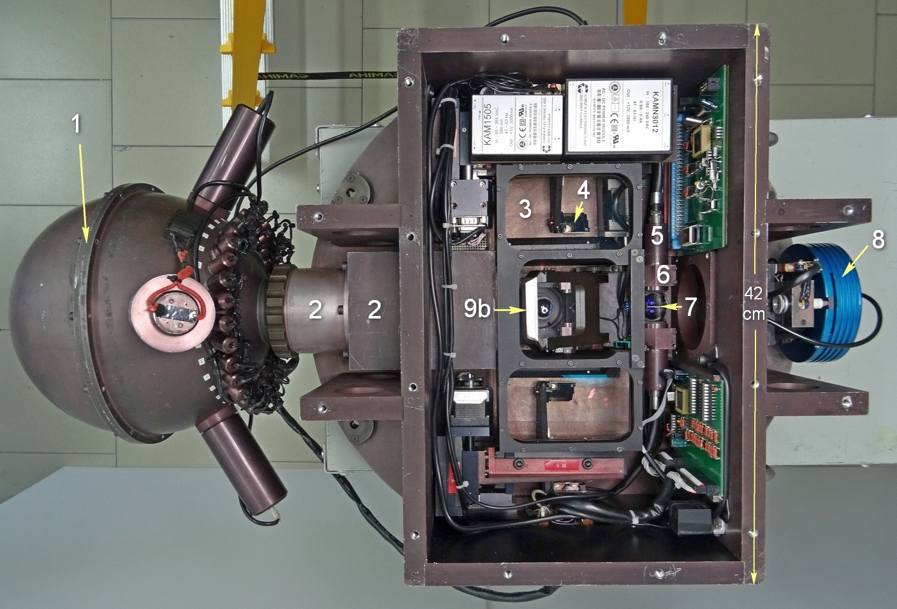
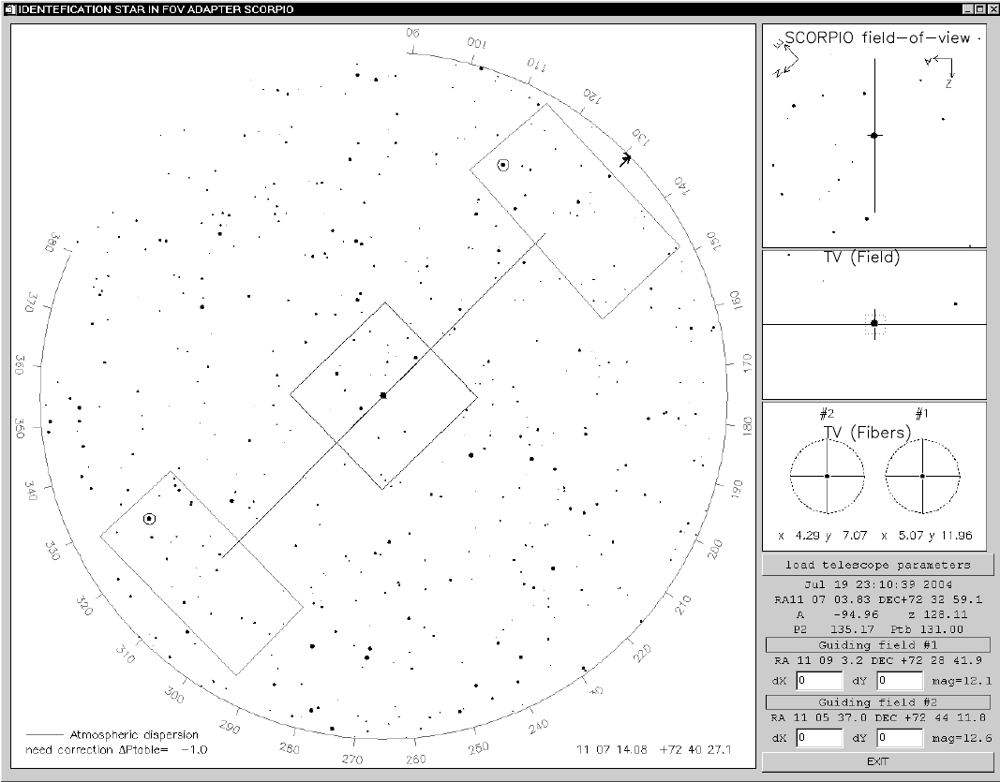
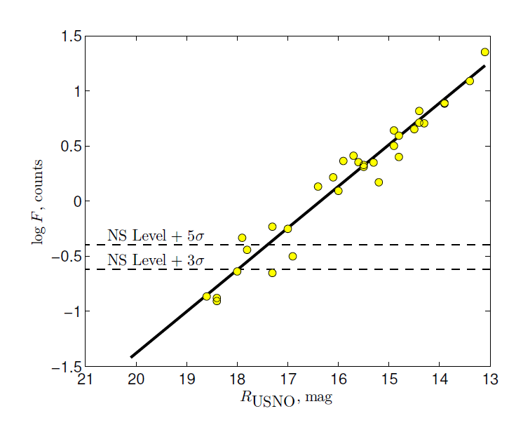
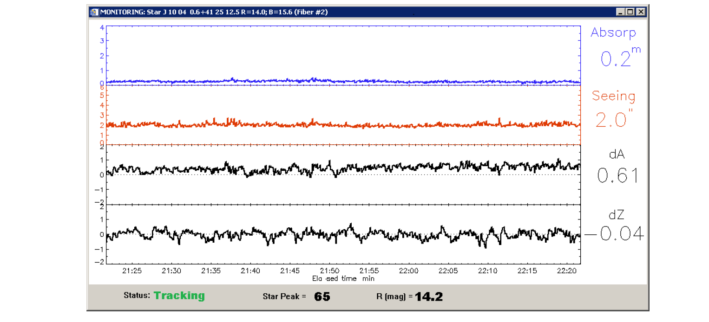
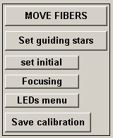
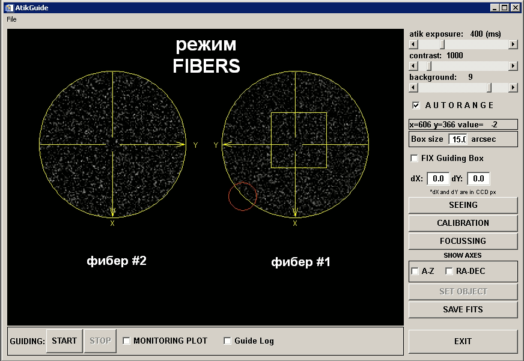

[TOC]

# 1 Введение
## Общий вид

Адаптер устанавливается на поворотном столе в кабине первичного фокуса БТА и применяется как для внеосевого гидирования, так и для телецентрической засветки входа устанавливаемого на нем прибора различными калибровочными источниками света. Кроме фокальных редукторов SCORPIO-1 и SCORPIO-2 на нем могут быть установлены и другие спектрографы весом до 150 кг и рабочим отрезком не более 40 мм.


**Рис.1**. *Оптическая схема (выше)  и фотография (ниже) Адаптера*: *1 — интегрирующая сфера, 2 — оптика осветителя калибровки, 3 — внеосевой линзовый корректор, 4 — зеркало, 5 — жгут световодов, 6 — линза световода, 7 — отражающая призма, 8 — подсмотр, 9 — диагональное зеркало (показаны оба положения): 9a — FIBERS, 9b — FIELD.* 




На **Рис. 1** приведена схема адаптера. В адаптере имеются два подвижных поля для поиска опорных звезд. Свет от такой звезды сначала попадает на внеосевой линзовый корректор (3), который компенсирует кому главного зеркала телескопа. Далее диагональное зеркало (4) перебрасывает свет на входной торец жгута световодов (5), который вместе с зеркалом перемещается по полю в двух перпендикулярных направлениях линейными
подвижками фирмы STANDA[^1]. Угловой диаметр жгута световодов в проекции на небесную сферу при этом составляет 54", а размер поля для его перемещения — 10' × 4 .5'. Центры гидировочных полей находятся на расстоянии 12' от центра полей зрения системы, относительное расположение полей показано далее в **Подразделе 3.2**. Изображения выходных торцов световодов проецируются линзой (6) и направляются призмой (7) и диагональным зеркалом (9) на фокальную плоскость светоприемника подсмотра (8). Зеркало (9) имеет два рабочих положения — *FIBERS* (9a) и *FIELD* (9b). На рис. 1 показаны оба положения. При положении *FIBERS* свет от объектов наблюдения принимается аппаратурой, установленной на адаптере (зеркало выведено из пучка), а подсмотр принимает изображения опорных звезд. В положении *FIELD* диагональное зеркало передает изображение основного поля зрения на подсмотр (зеркало перекрывает центральный пучок), что позволяет делать отождествление поля, в том числе устанавливать на щель яркие объекты. Размер поля FIELD на подсмотре составляет 3' × 2'. В этой же позиции зеркала проводится калибровка основного приемника с помощью интегрирующей сферы (1).

Подробнее калибровочный модуль описан в [**Разделе 4**](3_Calibration.md).


## Внеосевой линзовый корректор

Основной проблемой при внеосевом гидировании на БТА является аберрация комы параболического зеркала. Штатный корректор исправляет аберрации в поле диаметром 18 и не может быть использован в нашей схеме, поскольку устанавливаемые на адаптер приборы работают без линзового корректора. Нами разработан и изготовлен относительно простой двухлинзовый корректор из отечественных стекол К8 и ТФ3. Корректор ахроматизован в диапазоне 0.5–0.7 мкм и дает эквивалентное фокусное расстояние телескопа 18.5 м. Оптическая схема корректора представлена на **рис. 2**. 


**Рис.2**. *Оптическая схема внеосевого линзового корректора.* 

Фокальная поверхность корректора FC в пределах движения жгута световодов в первом приближении плоская. Ее наклон к фокальной плоскости телескопа FT составляет 3*.*9 *◦* . 

На **рис. 3** показан результат исправления комы на расстоянии примерно 12' от оси главного зеркала.


**Рис.3**. Расчетные точечные диаграммы на расстоянии примерно 12" от оси главного зеркала: слева — без корректора, справа—с корректором.


Расчетная полихроматическая функция рассеяния скорректированного изображения показана на **рис. 4**. 


**Рис.4.** Средняя концентрация энергии в кружке (пятне) рассеяния в пределах диапазона расстояний 8–15' от оптической оси.

Как видно на рисунке, качество (*FWHM*) формируемого совместно с корректором изображения не хуже 40 мкм, что соответствует примерно 1"*;* этого вполне достаточно для гидирования. Расчеты оптической схемы сделаны при помощи программы ZEMAX[^2].


## Подсмотр

Вначале мы использовали в качестве подсмотров телевизионные передающие трубки ЛИ-702 с предусилением на ЭОП с микроканальной пластиной. Начиная с 2007 г. в качестве подсмотра для гидирования используется промышленный монохромный приемник ПЗС Sony ICX429ALL формата 1/2 дюйма. Число элементов—582 *×* 752. Управление его параметрами осуществляется с помощью интерфейса RS-232, а оцифровка изображения производится TV-тюнером. К концу 2017 г. планируется переход на коммерческую камеру Atik Titan[^3] на основе аналогичного приемника Sony ICX424 с передачей изображений в компьютер по интерфейсу USB. На рис. 5 (слева) приведен пример изображения основного поля звезд — *FIELD*. Для наглядности приведены значения звездных величин в полосе *R*  для некоторых звезд. Для режима FIELD размер поля составляет 3’ *×* 2’*.* Справа на **рис. 5** приведен пример изображения от световодов — *FIBERS*. Из-за поглощения в световодах в режиме *FIBERS* пропускание в два раза ниже, чем в режиме *FIELD*. Однако  чувствительности приемника достаточно для уверенной регистрации безлунного фона неба.


**Рис. 5**. Пример изображений в режиме FIELD (слева) и FIBERS (справа). Указаны звездные величины слабых звезд в полосе R по данным USNO2.0.

## Система управления

Управление адаптером реализовано аналогично управлению другими узлами прибора SCORPIO-2. Разработаны две платы, оснащенные микропроцессорами ATmega8535L и силовыми микросхемами для управления семью шаговым двигателями и калибровками адаптера. Одна плата управляет четырьмя двигателями перемещения двух гидировочных полей по координатам *X*, *Y* и двумя двигателями фокусировки этих полей. Вторая плата управляет двигателем переброса диагонального зеркала FIELD/FIBERS, лампой линейчатого спектра (NEON), лампой непрерывного спектра (QUARTZ) и работой 32 светодиодов, формирующих плоское поле.

Пределы перемещений всех подвижек контролируются концевыми выключателями. Текущее положение гидировочных полей (*X, Y* ) и величина фокуса рассчитываются по числу пройденных шагов от начального положения. Внешние команды управления на микропроцессоры передаются по стандартному интерфейсу RS-422 от управляющего промышленного компьютера, работающего в среде Windows. Программы микропроцессоров настроены на самостоятельную работу: получив команду, они выполняют ее и по запросу управляющего компьютера сообщают о результатах. Интерфейс управления адаптером написан на языке IDL4 и интегрирован в общую систему управления прибором SCORPIO-2.


# 2 Модуль гидирования
После наведения на исследуемый объект перед началом гидирования наблюдатель выполняет ряд подготовительных процедур, включающих поиск опорных звезд, подбор оптимальной яркости на подсмотре, предварительное центрирование. Потом запускается программа гидирования. В случае отклонения центроида изображения звезды от заданного наблюдателем положения на подсмотре она отправляет управляющей телескопом программе поправки для коррекции.


## Программа поиска опорных звезд

Для ускорения процесса наведения и поиска опорных звезд мы используем пакет программ  IDENTSTAR, написанный на языке IDL и позволяющий по переданным из управляющего компьютера БТА координатам и ориентации поворотного стола вычислять текущие инструментальные координаты полей звезд гидирования в поле зрения адаптера. На **рис. 6** показан вид интерфейса программы поиска звезд. После запуска программа считывает с сервера БТА текущие  координаты телескопа и выбирает из каталога USNO2.0 координаты всех звезд ярче 20 mag в данной площадке неба радиусом 15’*.*



**Рис. 6.** Интерфейс программы поиска гидировочных звезд

Большой центральный квадрат в окне отмечает положение поля зрения SCORPIO-2 (6 *×* 6*),*  прямоугольниками выделены положения пределов перемещения полей гидирования, внутри которых программа ищет звезды для гидирования. Маленькими кружками, размеры которых соответствуют диаметрам жгутов световодов, выделены наиболее яркие звезды, которые были автоматически выбраны программой. Их звездные величины и положение в системе координат платформы-адаптера отображаются в правых нижних полях окна программы. При необходимости наблюдатель может выбрать другую опорную звезду из доступных в поле. Одновременно со звездной картой из каталога на подсмотре отображается расчетная конфигурация звезд в положениях FIELD/FIBERS. Как показывает опыт наблюдений, время на поиск и установку звезд гидирования обычно не превышает нескольких минут. При этом возможна  предварительная установка звезд во время перенаведения телескопа с одного объекта на другой.

## Программа гидирования

Для автоматического гидирования по выбранной звезде используется программа TVGuide, написанная нами в среде IDL на основе оцифровки изображения подсмотра с коммерческой камеры Atik Titan[^3] на основе приемника Sony ICX424 с передачей изображений в компьютер по интерфейсу USB.

На **рис. 5** (слева) приведен пример изображения основного поля звезд — *FIELD*. Для наглядности приведены значения звездных величин в полосе R для некоторых звезд. Для режима *FIELD* размер
поля составляет 3’ × 2’. Справа на рис. 5 приведен пример изображения от световодов — *FIBERS*.
Из-за поглощения в световодах в режиме *FIBERS* пропускание в два раза ниже, чем в режиме FIELD.
Однако чувствительности приемника достаточно для уверенной регистрации безлунного фона неба.

 

**Рис.5**. *Пример изображений в режиме FIELD (слева) и FIBERS (справа). Указаны звездные величины слабых звезд в полосе R по данным USNO2.0.*

Кроме визуализации изображения с подсмотра программа позволяет накладывать на изображение электронные кресты и метки. В зависимости от положения зеркала адаптера в большом окне программы на изображении отображаются либо положение щели в поле FIELD с исследуемым объектом, либо два креста в полях гидирования FIBERS, в центры которых захватываются звезды.


## Предельные звездные величины

В процессе гидирования тюнер опрашивает выход подсмотра с частотой 25 кадров в секунду; для улучшения шумовых характеристик изображения усредняются скользящим средним с окном от 2 до 50 кадров. Измерения предельных величин звезд, пригодных для гидирования, проводились в ноябре 2015 г. при ясном небе и качестве изображений *θ* = 1 *−* 1 .5”. График оценок потока опорных звезд в зависимости от их звездной величины по каталогу USNO2.0 приводится на **рис. 7**. 



**Рис. 7.** *Логарифмы потоков опорных звезд lg F в зависимости от их звездной величины RUSNO. При считывании изображений использовался режим скользящего среднего по 10 кадрам.*

Интенсивность была предварительно скорректирована за коэффициент усиления ПЗС-подсмотра, настраиваемый отдельно для каждой опорной звезды. Штриховые линии показывают уровни шума ночного неба с порогом обнаружения 3<sub>*σ* NS</sub> и 5<sub>*σ* NS</sub>. Линия регрессии пересекает штриховые линии в точках 18.0<sup>m</sup> и 17.4<sup>m</sup>, что дает предельные звездные величины в полосе *R* для отношений сигнала к шуму *S/N* = 3 и 5 соответственно. Оптимальным для гидирования является диапазон звездных величин 10 – 15 mag. Гидирование по звездам слабее 15<sup>m</sup> возможно только при хорошем качестве изображений и достаточной прозрачности. Следует отметить, что из-за особенностей системы управления БТА автоматическая коррекция координат осуществляется с частотой не более 0.1 Гц.

## Контроль прозрачности атмосферы и качества гидирования

Калибровка нуль-пункта для каждого жгута световодов подсмотра осуществлялась по наблюдениям реальных звезд при хорошей прозрачности. Ее результаты представлены на **рис. 8**. После  проведенных нами процедур калибровки стал возможен количественный контроль прозрачности атмосферы по опорным звездам. Отметим, что в ходе наблюдений калибровочные зависимости продолжают уточняться. Систематические ошибки измерения поглощения в атмосфере из-за несоответствия кривой чувствительности приёмника подсмотра и кривой пропускания фильтра *R*USNO по нашим оценкам не превышают 0.5 mag. Для контроля качества гидирования на монитор управляющего компьютера может выводиться график, на котором отображаются: текущее значение поглощения, размер изображения опорной звезды и величины коррекции по азимуту и зенитному расстоянию (см. **рис. 9**).



**Рис. 9.** *Интерфейс окна мониторинга изображения опорной звезды. В заголовке окна: координаты звезды, звёздные величины в фильтрах R и B из каталога USNO2.0, номер жгута световодов. Графики сверху вниз: поглощение в фильтре R, качество изображения, смещение центроида опорной звезды по азимуту (в угловых секундах), аналогичное смещение по зенитному расстоянию. Справа: текущие значения; внизу: статусная строка.*

## Фокусировка

Входной торец каждого из гидировочных жгутов перемещается вдоль оптической оси в пределах 0–9.7 мм для фокусировки опорной звезды (см. **рис. 1**). Это дает возможность проводить при необходимости коррекцию фокуса телескопа во время длительной (более одного часа) серии спектральных экспозиций. Опыт наблюдений на БТА показывает, что изменения фокуса из-за температурных деформаций штанг трубы телескопа за это время могут превышать 0.1–0.2 мм, что является существенной величиной в случае хорошего качества изображений (*θ <* 2”). Выполнив фокусировку телескопа и гидировочных микроскопов перед началом серии экспозиций, можно в дальнейшем контролировать положение лучшего фокуса, используя механизм фокусировки гидировочных полей и осуществлять компенсирующую коррекцию фокусного расстояния телескопа. Наличие двух гидировочных полей позволяет проводить процедуру контроля фокуса по одной из звезд, пока другое поле используется для сопровождения телескопа.


# 3 Модуль калибровки
## Общее описание

Калибровочный модуль состоит из интегрирующей сферы (шар Ульбрихта), оптики осветителя калибровки и системы управления. Интегрирующая сфера имеет два осветителя линейчатого спектра, осветитель непрерывного спектра и 32 порта для установки светодиодов в качестве осветителей. Как источник линейчатого спектра используется газоразрядная радиолампа СГ3С с наполнением He–Ne–Ar. Источники непрерывного спектра—одна галогеновая лампа с кварцевым стеклом Osram Halopar-16 50W и серия из 32 светодиодов.


**Рис.** *Калибровочная лампа Адаптера ПФ: 1 – интегрирующая сфера; 2 – крепление к платформе-адаптеру; 3 – кварцевая лампа; 4 – светодиодная система; 5a, 5b – He–Ne–Ar лампы; 6 – разъем управления и питания светодиодами; 7 – разъем питания неоновой лампы; 8 – специальная подставка для транспортировки.*

Оптика осветителя калибровки формирует на входе редуктора сходящийся пучок со светосилой, эквивалентной светосиле телескопа (*f/*4). При этом изображение равномерно освещенной площадки на выходе интегрирующей сферы строится там же, где находится изображение зеркала телескопа (выходной зрачок) и, следовательно, выполняется условие телецентризма. Проецируемый диаметр площадки осветителя совпадает с диаметром зрачка. В нашем случае точность выполнения условия телецентризма оказывается не хуже 0.2%. Такое решение позволяет проводить корректную калибровку шкалы длин волн лампой линейчатого спектра и калибровку пропускания системы по полю в различных режимах спектральных наблюдений («плоское поле»). Выходная площадка интегрирующей сферы освещается тремя способами:

- NEON: лампа с He–Ne–Ar-наполнением для калибровки шкалы длин волн. Используется в режимах щелевой и панорамной спектроскопии, а также при наблюдениях со сканирующим интерферометром Фабри–Перо [10]. Калибровка обычно выполняется каждый раз, когда изменение зенитного расстояния телескопа превышает 10–20*◦*, с целью учета гнутий прибора.

- QUARTZ: кварцевая галогеновая лампа непрерывного спектра для создания «плоского поля». Калибровка обычно выполняется в начале и в конце наблюдений в режиме сканирующего интерферометра и несколько раз в течение ночи при спектральных наблюдениях на разных зенитных расстояниях. Существенным недостатком такого осветителя является сильное падение яркости лампы в голубой области, так как максимум ее излучения приходится на длину волны около 1200 нм. Поэтому на длинах волн *λ <* 500 нм в наблюдаемый спектр лампы вносится существенный вклад рассеянного света от более длинноволновой части спектра. Применение выравнивающих светофильтров немного улучшает ситуацию.

- LEDS: система светодиодов, обеспечивающая формирование непрерывного спектра для «плоского поля» с приблизительно равномерной по спектру яркостью в широком диапазоне длин волн. Это позволяет проводить равноточную засветку плоского поля в различных спектральных диапазонах и уменьшает паразитный рассеянный свет в голубой области. Впервые подобное решение было предложено для фотометрической калибровки на малых телескопах **[11, 12]** и пока еще не используется на крупных. Например, систему из 18 светодиодов планируется применять в осветителе «белого света» спектрографа EXPRES **[13]**.


Остановимся подробнее на последнем варианте засветки — светодиодной системе LEDS.


## Светодиодная система

Современная промышленность предоставляет широкий ассортимент различных светодиодов (light-emitting diode, LED) во всем оптическом диапазоне. Каждый светодиод излучает непрерывный спектр в узком диапазоне с шириной полосы около 10–20 нм. Подбирая яркости отдельных элементов в наборе таких светодиодов, можно конструировать спектральное «плоское поле» для различных решеток с учетом спектральной чувствительности устанавливаемого на адаптере прибора. Для управления яркостью отдельных светодиодов мы используем широтно-импульсную модуляцию (ШИМ). При этом на каждый светодиод подается периодический сигнал прямоугольной формы с различной скважностью, изменяющейся дискретно в диапазоне от 0 до 253. Такая реализация наряду с простотой в исполнении обеспечивает высокую стабильность яркости светодиодов. Управление светодиодами осуществляется тем же микропроцессором, который установлен на второй плате (см. **Подраздел 2.4**). Программа, запускаемая на управляющем компьютере в среде IDL, позволяет выбирать либо стандартную конфигурацию засветки, либо индивидуально настраивать яркости отдельных светодиодов.

Для иллюстрации методики LEDS на **рис. 10** приведен пример сконструированного «плоского поля» для решетки VPHG940@600, имеющей рабочий диапазон 3500–8500 A˚.


**Рис. 10.** *Спектральные «плоские поля» для решетки VPHG940@600, полученные c помощью кварцевой лампы QUARTZ (с выравнивающим светофильтром) и системы светодиодов (LEDS). Порядковыми номерами показаны спектральные кривые соответствующих светодиодов. Спектры нормированы на экспозицию в 1 секунду.*


## Стабильность светодиодов

Калибровочная лампа, состоящая из набора светодиодов, должна обеспечивать повторяемость формы спектра в диапазоне температур Δ*T* = *−*20...+40*◦*C. Оценивая стабильность светового потока излучения диода при изменениях температуры внешней среды *T*, будем руководствоваться эмпирическим выражением из **[14]**:
$$
 F=F_{300} \exp\left(- \frac{ T[K] – 300}{T_1}\right)
$$
где *F*300 —поток диода при температуре, близкой к комнатной, *T*1 — характеристическая температура для данного класса диодов. Экспериментальные значения параметра *T*1 для синих, зеленых и красных диодов — 1600, 295 и 95 K соответственно взяты из **[14]**. Как видно из **(1)**, поток излучения красных диодов наиболее чувствителен к изменениям температуры и, следовательно, в этом диапазоне вариации формы спектра будут наиболее сильны. Оценим ее стабильность, рассмотрев чувствительность потока красных светодиодов как худший вариант. Возьмем производную от выражения **(1)**:
$$
\delta F/F_{300}= -\exp\left(-\frac{T – 300}{T_1} \right) \frac{\delta T}{T_1}
$$
и рассчитаем температурный коэффициент потока при изменении температуры на один градус. В таблице для иллюстрации эффекта приведены характерные значения производных в рабочем диапазоне температур для красных светодиодов. При оценке возможных колебаний спектра лампы необходимо учесть, что за время спектральной экспозиции (от 5 до 60 минут) температура в первичном фокусе телескопа изменяется не более чем на 1–2*◦*C. Для оценки реальной стабильности светодиодной засветки в лаборатории были получены два ряда спектральных «плоских полей» с прибором SCORPIO-2 с использованием решетки VPHG940@600 —в течение 10 часов c шагом в 1 час и в течение 1 часа с шагом в 1 минуту. **На рис. 11** показаны относительные вариации «плоского поля» в зависимости от длины волны . 


**Рис. 11.** *Относительные вариации спектрального «плоского поля» с решеткой VPHG940@600, полученного светодиодной засветкой, в зависимости от длины волны.*


Область *A* показывает разброс для 10-часового эксперимента, что примерно имитирует ситуацию одной наблюдательной ночи. Для сравнения приведена область *B*, соответствующая расчетному пуассоновскому шуму. Пуассоновский шум рассчитывался как
$$
1/\sqrt{N_{s} \times gain},
$$
где  Ns — число отсчетов на данной длине волны, *gain*—коэффициент усиления ПЗС-приемника. Реальный шум в спектре показан жирной линией и хорошо согласуется с теоретическим. Область *C* показывает разброс для 1-часового эксперимента, что примерно имитирует ситуацию наблюдений одного объекта. Видно, что вариации в течение часа (*C*) меньше пуассоновского шума (*B*). Определение вариаций обоих рядов данных и величины пуассоновского шума проводилось в интервалах шириной 200A.  Следует отметить, что, несмотря на небольшие колебания  температуры внешней среды за 10 часов (в пределах 5*◦*C), мы видим постепенное увеличение амплитуды вариаций от 1% до 2% с ростом длины волны . После 7500A вариации падают до 1%, что отражает вклад второго порядка решетки VPHG940@600, а засветка в этом диапазоне также формируется голубыми светодиодами. Итак, «плоское поле,» получаемое по методике LEDS, дает более равномерную засветку по длинам волн в сравнении с QUARTZ (**рис. 10**). Было бы разумно предположить, что гибридное «плоское поле» QUARTZ+LEDS, в котором LEDS исправляет  недостатки QUARTZ в синем спектральном диапазоне, является оптимальным решением. Однако светодиоды и кварцевая лампа расположены близко друг к другу, и кварцевая лампа при включении сильно прогревается, поэтому при одновременном использовании обеих засветок свойства светодиодов изменяются. Это стоит учитывать при наблюдениях и проектировании аналогичных систем. 

> ВНИМАНИЕ: Рекомендуется при спектральных наблюдениях в течение ночи использовать LEDS до QUARTZ (если необходимы оба типа засветки), а также разграничить их использование при калибровках до или после наблюдений.

Тот факт, что светодиоды сейчас широко распространены и относительно дешевы, дает основание полагать, что подобная методика может легко внедряться на современных спектрографах.


# 4 Управление Адаптером
В данном разделе будут подробно описаны все элементы управления Адаптером. До начала работы необходимо запустить основную оболочку SCORPIO и программу гидирования.

Иконки программ управления SCORPIO и камерой гидирования Atik:  

## Общий вид


## Отличия от интерфейса управления старой платформой
- Положение зеркала, ламп и концевиков подвижек постоянно мониторятся и отображаются.
  Во время переезда, состояние зеркала = GO.
- У лампы FLAT - два параметра: QUARTZ (лампа непрерывного спектра) и LEDs (линейка
  светодиодов). Можно выделить флажком один или сразу оба.
- Вместо того, чтобы нажимать кнопки **`MOVE fiber 1/2`**, **`MOVE FIBERS`**,  **`SHIFT, pх CCD`**,
  достаточно нажать [ENTER] в соответствующем поле.
- Можно одновременно запускать перемещения любого элемента, пока другие еще едут.
- Если нажать одновременно стрелочки X и Y – будет ехать сразу по обеим координатам.
- Кнопка **`set initial`** устанавливает в ноль только X и Y, не двигая фокус и зеркало.
- Добавлена кнопка вызова программы управления светодиодами и лампами LEDs menu
- Управление фокусами обоих микроскопов вынесено в отдельное меню (**рис. ??**), запускаемое кнопкой **`focusing`**. Из этого меню есть возможность двигать фокус стрелочками с клавиатуры, зарезервированы поля для автофокусировки.


## Поворотный стол

Запускается кнопкой **`PA ROTATION`**


Для установки требуемой ориентации щели спектрографа необходимо в меню управления платформой адаптером нажать кнопку **`PA Rotation`.** Открывается окно ‘POSITION ANGLE of the SLIT’ показанное на **рис**. выше. Здесь слева красной линией показано текущее положение щели спектрографа относительно направлений "север-юг" и "запад-восток, а справа такой же линией отмечено текущее положение поворотного стола ПФ. Красная стрелочка показывает скорость вращения стола в единицах <sup>◦</sup>/час.
Ниже в виде таблицы указаны текущие значения **Current** угла поворотного стола **PA(table)** и позиционного угла щели **PA(slit)** (отсчитывается от направления на север против часовой стрелки). 

В графе **Texp** показывается время, оставшееся до достижения концевика поворотного стола (т.е. максимальное время экспозиции, при условии, что будут продолжаться наблюдения данного объекта).

Графа **New** предназначена для ввода новых значений углов. Причем можно вводить как значения PA(slit), так и PA(table), при вводе одного из этих углов второй пересчитывается (константу для пересчета программа берет из конфигурационного файла). Новые значения углов отображаются на графиках синим пунктиром, а в графе Texp показывается максимально возможное время экспозиции с новым положением поворотного стола. Нажатие кнопки **`PA+180`** меняет значения новых углов на 180<sup>◦</sup>, это полезно в тех случаях, когда требуются либо более продолжительные экспозиции, либо меньшее различие между текущим и новым положением поворотного стола. 

Нажатие кнопки **`Rotation`** приводит к вращению поворотного стола к его новому положению. Остановить вращение стола из этого меню нельзя, надо использовать программы непосредственного управления телескопом на компьютере robs1 (интерфейс оператора БТА и т.п.).
**`QUIT`** – выход из программы.

## Поиск звезд гидирования

Запускается кнопкой **`FIND GUIDING STARS`**


## Диагональное зеркало и осветители


Кнопка **`MIRROR`**  переключает диагональное зеркало (или переброса) между двумя положениями — *FIELD* и *FIBERS*.

Кнопка **`NEON`**  принудительно включает лампу линейчатого спектра He-Ne-Ar.

Кнопка **`FLAT`**  принудительно включает лампу непрерывного спектра на основе кварца.

- [ ] QUARTZ  - флажок, позволяющий использовать кварцевую лампу в режиме накоплений **flat**
- [x] LEDs - флажок, позволяющий использовать светодиоды в режиме накоплений **flat**


## Коррекция телескопа в терминах пикселей CCD

Данная панель использует для точного наведения на щель и иных задач с помощью отправки смещений положения телескопа в системе координат CCD (X - горизонтальное смещение, Y - вертикальное смещение). 


Кнопка **`SHIFT, px CCD`** отправляет коррекции на телескоп, исходя из значения из полей **X:** и **Y:**, заданных в пикселах.

Смещение ползунков влево и вправо позволяет настроить значение смещения грубо. Для малых коррекций (особенно при установке объекта на щель) вводится более точное значение.

> ВНИМАНИЕ: для корректной работы требуется запуск скрипта bta_control_net на рабочем столе управляющего компьютера.

## Подвижки поисковых фиберов


## Дополнительная панель



**`MOVE FIBERS`** — устанавливает фиберы на значения из полей

**`Set guiding stars`** — забирает значения из полей фиберов из программы поиска звезд

**`set initial`** — устанавливает фиберы “в ноль”, т.е. на нуль-концевики

**`Focusing`** — фокусировка фиберов (отдельное окно)

**`LEDS menu`** — ручное управление светодиодами (отдельное окно)

**`Save calibration `** — (сервисная функция) сохраняет в специальный файл звездные величины для фотометрической калибровки гида (уточнить по коду)


## Фокусировка фиберов


## Программа гидирования





# 5 Подготовка к наблюдениям
1. Проверка засветки
2. Проверки гид-камеры
3. Проверка подвижек
4. Проверка поворотного стола


# 6 Наблюдения
Рассмотрим использование функционала Адаптера в контексте наблюдений на телескопе.


# 7 Устранение неполадок
В данном разделе приведен разбор наиболее частых неполадок, их причины и методы устранения.

> В случае невозможности устранения приведенных ниже ситуаций или возникновения новых обращайтесь к ответственному астроному Р.И. Уклеину.


| Неполадка                                                    | Причина                                                      | Устранение                                                   |
| :----------------------------------------------------------- | ------------------------------------------------------------ | ------------------------------------------------------------ |
| Программа поиска звезд показывает неправильные координаты телескопа. При фокусировке телескопа программа анализа изображений говорит что все значения фокуса одинаковые. В FITS-шапку записываются неправильные координаты и метеопараметры. | Сбой программы создания файла параметров телескопа *bta_write* на tb.sao.ru (перезагрузка сервера и т.п.) | 1. Кликнуть на иконку *bta_write* на рабочем столе<br />2. Напрямую запустить пакет d:/scorpio.cfg/bta_write.bat <br />3. Перезагрузить компьютер LERA/LERA2. |

   


# Приложение А. Файлы
## Положение зеркала

```
d:\scorpio.cfg\mirros.pos
```

При любом изменении положения зеркала обновляется файл d:\scorpio.cfg\mirros.pos в который записывается одно слово, соответственно FIBERS, FIELD или GO. Этот файл используется для обмена с программой гидирования.

## Программа гидирования

```
d:\ITT\IDL64\TVGuide\TVGuide_Atik.pro
```

Основная программа гидирования


## Конфигурационные файлы
Всю информацию о путях, экспозициях, нумерации ночей - (т.е. о том, что идентично со старым спектрографом), программа берет из старого параметрического файла d:\scorpio.cfg\remote.cfg, оставляя без изменения все, что относится только к старому прибору. 

Кроме того, в папке d:\scorpio-2.cfg есть еще следующие параметрические файлы:
```
scorpio-2.cfg
```

 – параметры спектрографа.
Здесь указаны номер COM-порта, положение устройств, которые не всегда отмечаются концевиками и датчиками Холла: маска на щель - MASKS, ширина щели (в arcsec) - SLIT WIDTH,
позиция каретки - CARRIAGE (здесь 0= IFU, 1=LONG SLIT, 2=IMAGE, 3=MULTISLIT) и положение анализаторов - ANALYSERS (0=hole, 1=LAMBDA/2, 2=LAMBDA/4, 3=POLAROID).
Файл перезаписывается, если данные устройства перемещались. В остальных случаях программа
ориентируется на данные опроса микропроцессоров.
Кроме того, здесь же хранятся имена установленных фильтров, решеток и ИФП, опорные значения фокусов коллиматора и камеры, а также информация о последней конфигурации режимов (фильтр для "IMAGES", ширина щели и решетки в моде "SLIT" и т.д.).
Файл конфигурации перезаписывается каждый раз при любых изменений положения устройств прибора. При этом предыдущая версия сохраняется в файл SCORPIO-2.cfg_bak.

---

```
filters-2.cfg
```

 – список фильтров с фокусировочными поправками. В отличии от старого вари-
анта, здесь есть дополнительный столбец Wheel (1-4) к котором через запятую указаны номера
турелей в которую фильтр предполагается устанавливать. Это сделано для удобства, чтобы про-
грамма не предлагала интерференционные фильтры для 3-й турели и т.д.

---

```
gratings-2.cfg 
```

– список решеток с параметрами.

---

```
ifp-2.cfg
```

 – список ИФП с параметрами.

---

```
adapter-2.cfg
```

 – текущее состояние платформы. Файл перезаписывается каждый раз при лю-
бых изменений положения микроскопов или зеркала. При этом предыдущая версия сохраняется
в файл adapter-2.cfg_bak.


# Приложение Б. Калибровочные спектры
## Б1 Атлас спектра сравнения лампы с He-Ne-Ar наполнением


## Б2 Спектры кварцевой лампы и светодиодов


